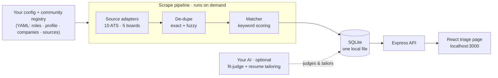

# Architecture

jobctl is **one process, one SQLite file**. A scrape pipeline pulls jobs and writes
them to the database, an Express server reads from it, and a React page is your
triage inbox. Optional AI sits on top. The whole thing runs on your machine.

## 🧰 Stack

| Layer | What we use |
|---|---|
| Language | TypeScript (ESM), Node 22+ — the server + CLI run straight from source via `tsx` (no build step) |
| Server | Express |
| Database | SQLite via better-sqlite3 (WAL) — one file, synchronous, prepared statements |
| UI | React + Vite + Tailwind |
| Config validation | zod (the loaders reject bad YAML before it's written) |
| Scraping | native `fetch` + cheerio for HTML boards |
| Resume / uploads | pdfkit (PDF render) · mammoth + pdfjs (`.docx`/`.pdf` extraction) |
| AI (optional) | your local Claude CLI, any OpenAI-compatible API, or Ollama |
| Tests | vitest |

*(Exact versions live in `package.json` — kept here name-only so it can't go stale.)*

## 🗺️ How it fits together



1. **Config** — your search (roles, locations) and the committed company registry
   live in plain YAML.
2. **Scrape** (on demand) — source adapters pull listings from company ATS APIs and
   job boards.
3. **De-dupe** — the same job across boards or reposts collapses to a single row.
4. **Match** — each job is scored against your role with deterministic keyword
   rules — no AI involved, so the result is explainable and repeatable.
5. **Store** — everything lands in one SQLite file.
6. **Serve & triage** — Express exposes a small REST API; the React page is where
   you review and set statuses.
7. **AI (optional)** — your chosen model judges fit and tailors resumes, layered on
   top of the data — never blocking the core.

## 🧩 The pieces

| Area | Path | What it does |
|---|---|---|
| Config | `src/config` | Loads and validates the YAML config (rejects bad input) |
| Sources | `src/sources/ats`, `src/sources/boards` | One adapter per ATS provider and job board |
| Scrape | `src/scraper` | Orchestrates a run: lock, fetch, de-dupe, re-score, decay |
| Matching | `src/matcher` | Keyword scoring and the de-dupe logic |
| Database | `src/db` | SQLite schema, migrations, and queries |
| Server | `src/server` | Express routes (jobs, scrape, stats, settings, …) |
| UI | `src/ui` | The React / Vite / Tailwind triage page and settings |
| AI (optional) | `src/judge`, `src/resume`, `src/authoring`, `src/llm` | Fit-judge, resume generation, config authoring, and the model backends |

## 🗄️ Data model

One SQLite file holds three tables:

- **`jobs`** — every job: its identity, de-dupe keys, match score and reasons,
  your status, and any optional AI verdict.
- **`scrape_runs`** — one row per scrape (status, counts, live progress); it also
  acts as the run-lock so two scrapes can't collide.
- **`source_state`** — per-source health (last success, recent empties) so a
  silently-broken source gets flagged instead of quietly dropping jobs.

## 📁 Project structure

```
jobctl/
├── config/                  # committed community data (YAML)
│   ├── companies.yaml          # company ATS registry, tagged by domain
│   ├── domains.yaml            # the 12-domain vocabulary
│   ├── role-templates.yaml     # ready-made role searches
│   ├── sources.yaml            # job-board definitions
│   └── categories.yaml         # category rules
├── profile.example/         # templates you copy to profile/
├── profile/                 # YOUR config (created on setup; stays on your machine)
├── src/
│   ├── config/              # load + validate YAML
│   ├── sources/
│   │   ├── ats/                # 10 ATS provider adapters
│   │   └── boards/             # 5 job-board adapters
│   ├── scraper/             # scrape orchestration
│   ├── matcher/             # keyword scoring + de-dupe
│   ├── db/                  # SQLite schema, migrations, queries
│   ├── server/routes/       # Express API
│   ├── ui/components/        # React triage page
│   ├── judge/               # optional fit-judge
│   ├── resume/              # optional resume generation
│   ├── authoring/           # optional: draft config from your resume
│   ├── llm/                 # model backends
│   └── shared/              # shared types
├── docs/                    # user guides (matching, AI features, model tradeoffs)
├── README.md · ARCHITECTURE.md · CONTRIBUTING.md · SECURITY.md
└── CLAUDE.md                # exhaustive internal reference
```

## 🧭 A few deliberate choices

- **Local-first, single user.** There's no login — it's meant to run on your own
  machine. If you put it on a network, add your own auth first (see
  [SECURITY.md](SECURITY.md)).
- **No AI required, no vendor lock-in.** The scrape→match→triage core is plain
  keyword logic you can read and run fully offline. AI is strictly additive, and
  you choose the model — your local Claude CLI, any OpenAI-compatible API, or a
  local Ollama model.
- **No headless browser.** Every source is a plain HTTP request to a public API or
  feed — nothing to keep a browser engine alive for.
- **Deterministic matching.** The same config and JD always produce the same score,
  so results are debuggable and reproducible.
- **No Docker.** The optional resume-gen and fit-judge features use your host's
  `claude` CLI, which can't run in a container — so reproducibility comes from
  `.nvmrc` + `package-lock.json` (`nvm use && npm ci`) instead of an image.

> [!NOTE]
> Want the exhaustive detail — exact scoring weights, de-dupe invariants,
> reliability rules, and ATS endpoint patterns? That lives in
> [CLAUDE.md](CLAUDE.md), the project's internal source of truth. This page is
> the readable overview.
