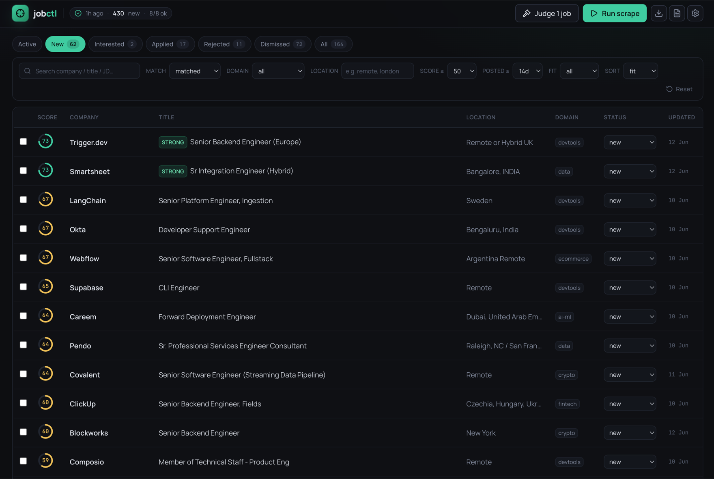
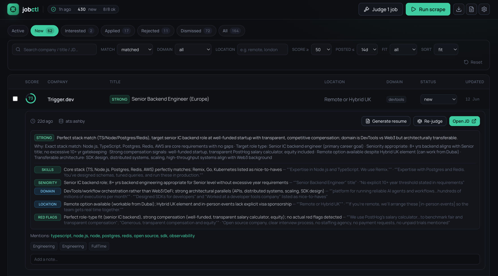

<div align="center">

# jobctl

### The self-hosted job copilot for the software industry

**Your machine · your model · your data** — free, private, and 100% local.


&nbsp;
&nbsp;
&nbsp;

<br>



<br><br>

</div>

It scrapes company career pages and tech job boards, scores every listing against
*your* profile, and hands you **one fast page** to triage — so you check one place
instead of ten, and never see the same job twice. 🎯

The whole core — scrape, de-dupe, score, triage — runs with **no AI at all**, even
offline. Want help with the reading-heavy part? Bring your own model (Claude, any
OpenAI-compatible API, or local Ollama) to judge fit and tailor your resume. 🤖
Totally optional, and it's yours.

```
  company career pages  (Greenhouse · Lever · Ashby · Workable …)  ─┐
                                                                     ├─▶  dedupe ─▶ score ─▶ SQLite ─▶ triage page
  tech job boards       (remoteok · weworkremotely · himalayas · …) ─┘            (+ your AI)   (localhost:3000)
```

### ⚡ At a glance

- 🏢 **569 company career boards** — committed, live-verified, tagged by domain.
- 🗂️ **12 domains** — AI/ML, fintech, crypto/web3, cloud, dev tools, security, data, SaaS, gaming, consumer, e-commerce, health tech.
- 🔌 **10 ATS integrations** (Greenhouse, Lever, Ashby, Workable, …) **+ 5 job boards**.
- 🎛️ **70 role templates** across eng, design, product, data, marketing — pick one and the wizard fills in the keywords.
- 📈 One real run pulled **17,000+ live postings from 1,100+ companies** into a single local DB.

## 👤 Who it's for

One person running their own job search, who's tired of:

- 🔁 refreshing a dozen boards every morning,
- 👻 re-reading the same listing reposted under a slightly different title,
- 🤷 losing track of what they've already seen.

You set the roles, skills, and places you care about — jobctl does the fetching,
scoring, and de-duping, and hands you one page to work through.

## ✨ Why you'll like it

- **🗳️ One inbox.** Ten boards, one page. Mark a job `applied` or `dismissed` once and it's gone for good — even when it's reposted elsewhere.
- **🔍 No black box.** Matching is plain keyword rules you can read and tune, so you always know *why* a job scored what it did — and a tweak re-scores everything on the next run.
- **🔒 Private by default.** It's all one local SQLite file; your resume and search profile never leave your laptop.
- **🤖 AI only if you want it.** The core needs no model. Flip on the AI for sharper fit-verdicts and tailored resumes whenever you like.
- **🚀 A big head start.** 569 live-verified company boards across 12 domains — pick what you care about and go.

## ⚡ Quickstart

**You'll need:** Node 22+, npm, and git.

```bash
git clone https://github.com/rahuldamodar94/jobctl.git && cd jobctl
npm install
npm run build && npm start     # → http://localhost:3000
```

On first launch a **setup wizard** walks you through name → sources → your role →
(optional) resume, and writes your config for you — no file editing required. You
can change everything later under **Settings** in the app.

Then click **Run scrape** and start triaging. Just want to see the UI first? Hit
**Load sample jobs** on the empty state for a populated triage page you can clear
in one click.

> [!TIP]
> **Already job-hunting?** Jobs you've already applied to will show up as `new` on
> the first scrape. Mark them `applied` or `dismissed` once, and they're hidden
> for good — even when reposted elsewhere.

**Prefer editing files?** Copy the templates instead of using the wizard:
`cp -r profile.example profile`, then edit `profile.yaml` and `roles.yaml`.

## 🔄 How a day looks

```
  run scrape ─▶ new matches ─▶ you triage ─▶ interested · applied · rejected · dismissed ─▶ hidden next run
```

1. Open the UI and click **Run scrape** (or schedule `npm run scrape` with cron).
2. The status bar shows the result, e.g. `38 new · 5/5 sources OK`. Broken sources
   are named, never hidden.
3. Work the default view (`new`, score ≥ 30, posted ≤ 14 days): expand a row, open
   the JD, set a status.
4. You're done. Tomorrow, only genuinely new jobs show up.

## 🎯 Getting your keywords right (the part that matters most)

Worth two minutes, because **your matches are only as good as your keywords.** The
scorer is deterministic and literal — it does exactly what your config says — so a
sloppy role gives you noise, and a tuned one gives you a shortlist that's genuinely
yours. Your role (`roles.yaml`, edited in **Settings → Role**) has a few knobs:

- **Title keywords** — the gate. A job's title must contain one of these or it's
  skipped entirely. Too narrow and you miss real roles; too broad (a bare
  `engineer`) and you let in everything. Cover the real variants ("backend
  engineer", "software engineer", "platform engineer", …).
- **Must-have stack** — at least one must appear in the JD (e.g. `typescript`,
  `node.js`). This is your hard skill floor.
- **Nice-to-have weights** — keywords that *boost* (or, with negatives, *demote*)
  the score. This is where a generic match becomes a personal one.
- **Exclusions** — titles or primary languages that should be rejected outright
  (e.g. `intern`, `manager`, or a `rust`-primary role when you're a TS dev).

The wizard and the **role templates** give you a strong starting point, and you
can let the AI **fine-tune your role from your resume** (it keeps your title
keywords and tunes the weights and exclusions). A full walkthrough — how scoring
works end to end, and how to tune it — is in
**[docs/matching-and-keywords.md](docs/matching-and-keywords.md)**.

## 🤖 AI: optional, but it makes triage a lot better

The keyword core gives you a clean shortlist with **no model at all**. The AI sits
*on top* and does the reading you'd otherwise do by hand:

- **Fit-judge** reads each matched JD against a rubric *you* define and returns a
  **STRONG / DECENT / WEAK / SKIP** verdict, plus a per-dimension breakdown
  (skills · seniority · domain · location · red flags) **backed by short quotes
  from the JD** — so you can sort your shortlist by genuine fit instead of skimming
  every posting yourself. It's advisory: it adds a chip and a sort, and **never
  hides or blocks a job.**
- **Resume tailoring** drafts a one-page resume tuned to a specific job from your
  base resume, and renders it to a clean PDF — the model writes the words, the code
  controls the layout.

<div align="center">



<br>

<sub><i>Expand any job for the verdict + per-dimension reasoning, each backed by quotes from the JD.</i></sub>

</div>

Bring your own model — local **`claude` CLI** (your subscription, no key), any
**OpenAI-compatible API**, or local **Ollama**. Both features are off by default;
turn them on in **Settings → AI/LLM** with a one-click connection check.

Two things shape the output: the **judge rubric** (what counts as a good fit for
*you*) and the **resume-gen skill** (how your resume gets tailored). Both can be
**auto-authored from your resume** and refined by prompt — details in
**[docs/ai-features.md](docs/ai-features.md)**. 🙌

> [!IMPORTANT]
> **One privacy rule that matters:** free LLM tiers may train on what you send.
> That's fine for semi-public job descriptions (the judge), but **resume
> generation should use a paid or local backend that doesn't train on your data** —
> your resume is *you*. Which backend for which job is laid out in
> **[docs/model-tradeoffs.md](docs/model-tradeoffs.md)**.

## ⚙️ Configure

**Settings** in the app (and the first-run wizard) edits every file below with
validation — no terminal needed. The files stay the source of truth if you'd
rather edit them by hand:

| File | Owner | What it holds |
|---|---|---|
| `profile/profile.yaml` | you *(gitignored)* | which domains/boards to scrape, max job age, resumes, UI prefs |
| `profile/roles.yaml` | you *(gitignored)* | your single role search: titles, skills, weighted keywords, exclusions, location |
| `config/companies.yaml` | committed | the community company registry, tagged by domain |
| `config/sources.yaml` | committed | job-board definitions |
| `config/categories.yaml` | committed | category rules (the auto-detected Domain column) |

## 🌐 Where jobs come from

| Source | How it's fetched |
|---|---|
| Greenhouse / Lever / Ashby company boards | public board APIs (full JDs), driven by the registry |
| jobstash.xyz | public JSON API (full JDs) |
| Recruitee / Workable / Teamtailor / Personio / Breezy / Pinpoint / SmartRecruiters | public board APIs, driven by the registry |
| web3.career | static HTML |
| remoteok.com, weworkremotely.com, himalayas.app | public JSON/RSS feeds (general remote boards) |

Everything is a **public, programmatically-accessible** API or feed — nothing that
needs a login or a real browser. And it scrapes politely: a real user-agent, one
source at a time, per-host delays, backoff retries — a few hundred requests a run.

> [!NOTE]
> **Wondering why a big-name company isn't covered?** Most global giants run on
> Workday, iCIMS, or custom portals with no public API, so they can't be
> aggregated yet. Hundreds of researched companies — and *why* each isn't
> supported — are listed in
> [docs/companies-unsupported.md](docs/companies-unsupported.md).

- **Add a company:** paste its careers URL into `companies.include` in your
  `profile.yaml` (the provider is auto-detected), or open a PR to add it to the
  shared registry so everyone benefits.
- **Add a board:** drop one adapter file in `src/sources/boards/` implementing
  `{ id, fetch(ctx) }` and add an entry to `config/sources.yaml`. See
  [CONTRIBUTING.md](CONTRIBUTING.md).

## ⌨️ Commands

```bash
npm run scrape                 # scrape all enabled sources
npm run scrape -- --source X   # scrape one source (handy for debugging)
npm run judge                  # run the optional fit-judge over matched jobs
npm run dev                    # UI + API with hot reload
npm run build && npm start     # production build + serve
npm test                       # run the test suite
```

## 🏗️ Architecture

How the scrape → match → triage pipeline fits together — components, data model,
project structure, and the design choices behind it — is in
**[ARCHITECTURE.md](ARCHITECTURE.md)**.

> [!IMPORTANT]
> jobctl runs on **localhost with no login** — it's a single-user tool. Don't
> expose it to the internet without putting your own authentication in front. See
> [SECURITY.md](SECURITY.md).

## License

[MIT](LICENSE) © 2026 Rahul Prabhu
