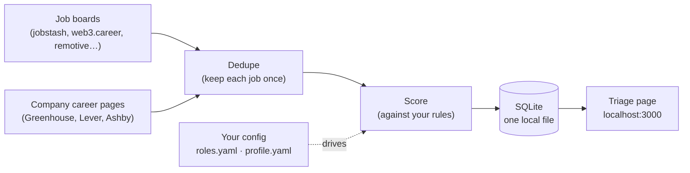
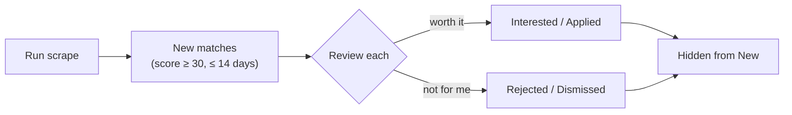

# jobctl

**A self-hosted job hunter for engineers.** It scrapes public job boards and
company career pages, scores every listing against *your* rules, and gives you
one fast page to review them — so you check **one place instead of ten**, and
**never see the same job twice**.

No LLM, no API keys, no running cost. Your data stays on your machine.



Ships with a curated, live-verified registry of **110+ company job boards**
(web3, DeFi, fintech/payments, exchanges, AI/dev-infra, with strong MENA & India
coverage). Pick the areas you care about and go.

## Why use it

- **One inbox.** Stop checking ten job boards every morning.
- **Your rules, instantly applied.** Title keywords, must-have skills, weighted
  boosts, hard exclusions, location tiers — all in plain YAML. Every scrape
  re-scores everything, so a tweak takes effect on the next run.
- **No repeats.** Once you mark a job applied or dismissed, it never comes back —
  even if it's reposted on another board with a slightly different title.
- **Local-first & private.** Everything lives in one SQLite file; your personal
  config is gitignored and never leaves your laptop.
- **Community registry.** 110+ company boards verified against their live APIs
  and tagged by domain.

## Quickstart

**You'll need:** Node 20+, npm, and git.

```bash
git clone https://github.com/rahuldamodar94/jobctl.git && cd jobctl
npm install
npm run build && npm start     # → http://localhost:3000
```

On first launch a **setup wizard** walks you through name → sources → your role →
(optional) resume, and writes your config for you — no file editing required.
You can change everything later under **Settings** in the app.

Then click **Run scrape** and start triaging.

> **Already job-hunting?** Jobs you've already applied to will show up as `new`
> on the first scrape. Mark them `applied` or `dismissed` once, and they're
> hidden for good — even when reposted elsewhere.

**Prefer editing files?** Copy the templates instead of using the wizard:
`cp -r profile.example profile`, then edit `profile.yaml` and `roles.yaml`.

**Developing?** `npm run dev` runs the UI with hot reload (port 5173, proxying
the API on 3000).

### Run with Docker

```bash
cp -r profile.example profile    # edit it, then:
docker compose up -d --build     # → http://localhost:3000
docker compose exec jobctl npm run scrape   # or use the UI button
```

`./data` (the database) and `./profile` (your config) are bind-mounted, so the
container stays stateless. **Linux note:** if SQLite reports read-only, set
`user: "<your-uid>:<your-gid>"` in `docker-compose.yml` — the bind mount is
owned by your host user.

## How a day looks



1. Open the UI and click **Run scrape** (or schedule `npm run scrape` with cron).
2. The status bar shows the result, e.g. `38 new · 5/5 sources OK`. Broken
   sources are named, never hidden.
3. Work the default view (`new`, score ≥ 30, posted ≤ 14 days): expand a row,
   open the JD, set a status.
4. You're done. Tomorrow, only genuinely new jobs show up.

## Configure

The easiest way is the in-app **Settings** page (and the first-run wizard) — it
edits every file below, validates your input, and never touches a terminal. The
files remain the source of truth if you'd rather edit them directly:

| File | Owner | What it holds |
|---|---|---|
| `profile/profile.yaml` | you *(gitignored)* | which domains/boards to scrape, max job age, resumes, UI prefs |
| `profile/roles.yaml` | you *(gitignored)* | your role searches: titles, skills, weighted keywords, exclusions, location, IC/EM lane |
| `config/companies.yaml` | committed | the community company registry, tagged by domain |
| `config/sources.yaml` | committed | job-board definitions |
| `config/categories.yaml` | committed | category rules (you can override per profile) |

## Where jobs come from

| Source | How it's fetched |
|---|---|
| Greenhouse / Lever / Ashby company boards | public board APIs (full JDs), driven by the registry |
| jobstash.xyz | public JSON API (full JDs) |
| web3.career, cryptocurrencyjobs.co, blockchainheadhunter.com | static HTML |
| remotive.com, remoteok.com | public JSON APIs (general remote boards) |

Scraping is polite by design: an identifiable user-agent, sources fetched one at
a time, per-host delays, and retries with backoff — a few hundred requests per run.

- **Add a company:** paste its careers URL into `companies.include` in your
  `profile.yaml` (the provider is auto-detected), or open a PR to add it to the
  shared registry so everyone benefits.
- **Add a board:** drop one adapter file in `src/sources/boards/` implementing
  `{ id, fetch(ctx) }` and add an entry to `config/sources.yaml`. See
  [CONTRIBUTING.md](CONTRIBUTING.md).

## Commands

```bash
npm run scrape                 # scrape all enabled sources
npm run scrape -- --source X   # scrape one source (handy for debugging)
npm run judge                  # run the optional fit-judge over matched jobs
npm run dev                    # UI + API with hot reload
npm run build && npm start     # production build + serve
npm test                       # run the test suite
```

## Optional: tailor a resume per job (no API key)

If you have the [Claude Code](https://claude.com/claude-code) CLI installed and
logged in, add a `RESUME_GENERATION_SKILL.md` to `profile/` (there's a template
in `profile.example/`) describing how you want resumes written. A **Generate
resume** button then appears on every job. Your local `claude` writes the
content — billed to your existing subscription, no API key — and jobctl renders
a one-page PDF into `profile/generated/`.

The split is deliberate: **the model writes the words, the code controls the
layout**, so the same input always produces the same PDF. The button hides
itself when the CLI isn't available (e.g. inside Docker — this feature is
host-only).

## Optional: fit-judge (advisory)

A second opinion on top of the keyword score. For matched jobs, it reads the JD
against a rubric you write and returns a verdict — **STRONG / DECENT / WEAK /
SKIP** — with reasons and any dealbreakers, shown as a chip you can sort and
filter by. It's **advisory only: it never hides or blocks a job.**

Turn it on with `llm.judge.enabled: true` in `profile.yaml` and add a
`profile/judge-rubric.md` (template in `profile.example/`). It runs on either:

- your local **`claude` CLI** (free, on your subscription — no API key), or
- any **OpenAI-compatible API** (OpenAI, Gemini, DeepSeek, OpenRouter, Ollama) —
  the key goes in an environment variable, never in YAML.

> **Privacy:** free LLM tiers may train on what you send. That's fine for
> semi-public job descriptions, but resume generation should use a paid or local
> backend that doesn't train on your data.

## Design decisions

A few deliberate choices, so they don't read as gaps:

- **No login, runs on localhost.** It's a single-user tool. Don't expose it to
  the internet without putting your own authentication in front — see
  [SECURITY.md](SECURITY.md).
- **No LLM in the core.** Scoring is plain keyword matching you can read, debug,
  and tune. The optional LLM features above sit *on top*, never in the critical path.
- **No headless browser.** Every supported source is plain HTTP. Sites that need
  a real browser are listed in `config/companies-unsupported.md`.
- **One SQLite file.** Dedup is a unique index, updates are transactions, and
  backup is a file copy.
- **Open ATS jobs are kept.** A job still returned by a company's own board is
  open by definition, so only aggregator listings are filtered by age.

## Architecture

For the full picture — data model, dedup and scoring rules, reliability
guarantees, and ATS endpoint patterns — see [CLAUDE.md](CLAUDE.md).

## The name

`jobctl` = "job control" — a `kubectl` / `systemctl`-style tool for running your
own job search, locally. Lowercase, self-hosted, yours.

## License

[MIT](LICENSE) © 2026 Rahul Prabhu
